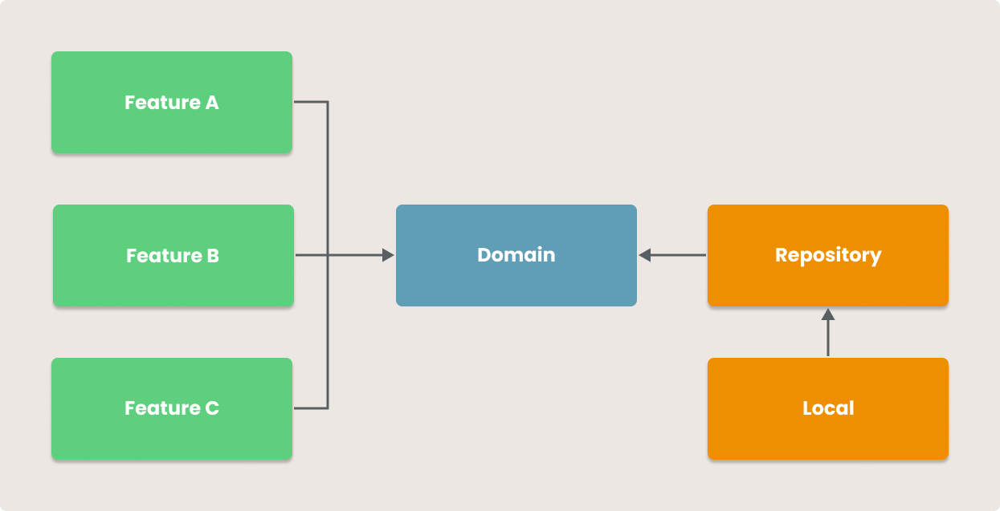

[](https://opensource.org/licenses/Apache-2.0)


# Leafy

Leafy is a free app for plant lovers that helps you save photos of your plants and set reminders to
feed them. It's open-source and a great resource for developers to learn about the latest Android
features. Try it out today! 🌱📱

## 🏗️ Built with

- Jetpack Compose
- Navigation Compose
- 100% Kotlin
- Kotlin Coroutines + Flow
- Hilt
- Room
- Ktlint
- Much more!

## 🗃 Architecture

The architecture of the app is based on the Hexagonal Architecture design pattern, which is a proven
approach to separating concerns and achieving better maintainability, testability, and scalability.
The app uses modularization to organize its components, making it easier to work with and understand
the code.

An example of the app's dependency flow can be seen in the preview below:



## 📋 License

```
Copyright 2022 Lucas Yuji Yoshimine

Licensed under the Apache License, Version 2.0 (the "License");
you may not use this file except in compliance with the License.
You may obtain a copy of the License at

   http://www.apache.org/licenses/LICENSE-2.0

Unless required by applicable law or agreed to in writing, software
distributed under the License is distributed on an "AS IS" BASIS,
WITHOUT WARRANTIES OR CONDITIONS OF ANY KIND, either express or implied.
See the License for the specific language governing permissions and
limitations under the License.
```
